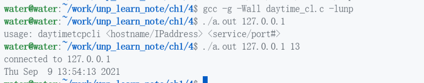

# unp_learn_note

我学习UNPv13e(《UNIX网络编程 卷一：套接字联网API》第三版)做到习题及部分笔记。

## Index

- [预备工作](#CH0-预备工作)
- [CH1 简介](#CH1-简介)
- [CH2 传输层：TCP、UDP、SCTP](#CH2-传输层TCPUDPSCTP)

### CH0 预备工作

[UNP repo](https://github.com/unpbook/unpv13e)  
[UNP 书上源码](./unpv13e)  
[UNP README](./unpv13e/README)

准备工作，先把 libunp.a(在libfree make生成) 放到 /usr/local/lib 中，然后把 unp.h(unpv13e/lib目录) 和 config.h(unpv13e目录) 放到/usr/local/include中，改一下unp.h让#include "config.h" 而不是 "../config.h"。  
做好这些工作之后，可以直接代码中引用unp.h，并-lunp连接静态库了，另外在linux上可能要去掉对 sys/sysctl.h 的引用，因为这个已经被弃用。  
最后为什么放在/usr/local下呢，因为这个是一般第三方非正式放的目录，这个比较合适。

### Note CH0

如果运行 ./daytimetcpcli 127.0.0.1 显示refused，这是因为inetd默认没开daytime服务，你修改 /etc/inetd.conf, 然后 service inetd restart 重启服务即可，另外linux ubuntu 可能没安inetd，需要 apt install 一下。

---

### CH1 简介

### 1.1 - 1.3

简单，略

### 1.4

### 1.5

---

### CH2 传输层：TCP、UDP、SCTP

### 2.1

---
