# unp_learn_note

我学习 UNPv13e(《UNIX 网络编程 卷一：套接字联网 API》第三版)做到习题及部分笔记。

## Index

- [预备工作](#CH0-预备工作)
- [CH1 简介](#CH1-简介)
- [CH2 传输层：TCP、UDP、SCTP](#CH2-传输层TCPUDPSCTP)
- [CH3 套接字编程简介](#CH3-套接字编程简介)
- [CH4 基本 TCP 套接字编程](#ch4-基本-tcp-套接字编程)
- [CH5 TCP 客户/服务器程序示例](#CH5-tcp-客户服务器程序示例)
- [CH6 I/O 复用：select 和 poll 函数](#ch6-io-复用select-和-poll-函数)
- [CH7 套接字选项](#CH7-套接字选项)
- [CH8 基本 UDP 套接字编程](#CH8-基本-UDP-套接字编程)
- [CH11 名字与地址转换](#CH11-名字与地址转换)

因为很快就要投实习简历了，所以暂时搁置一下这本书，先看完 ch1-8 和 ch11，也就是基础 socket 编程除了 sctp 的部分，等以后有空(应该要等到我拿到实习 offer 了^\_^)再回来看 UDP，另外就算回来看 UDP 的时候 sctp 协议也不打算看了，sctp 推迟到用的时候再看，因为真的用不到 XD。。。

### CH0 预备工作

[unpv13e repo](https://github.com/unpbook/unpv13e)  
[UNP 书上源码](./unpv13e)  
[UNP README](./unpv13e/README)

准备工作，先把 libunp.a(在 libfree make 生成) 放到 /usr/local/lib 中，然后把 unp.h(unpv13e/lib 目录) 和 config.h(unpv13e 目录) 放到 /usr/local/include 中，改一下 unp.h 让 #include "config.h" 而不是 "../config.h"。  
做好这些工作之后，可以直接代码中引用 unp.h，并 -lunp 连接静态库了，另外在 linux 上可能要去掉对 sys/sysctl.h 的引用，因为这个已经被弃用。  
最后为什么放在 /usr/local 下呢，因为这个是用户级第三方非正式的东西放的目录，比较合适。

### Note CH0

如果运行 ./daytimetcpcli 127.0.0.1 显示 refused，这是因为 inetd 默认没开 daytime 服务，你修改 /etc/inetd.conf, 然后 service inetd restart 重启服务即可，另外 linux ubuntu 可能没安 inetd，需要 apt install 一下。

---

### CH1 简介

### 1.1 - 1.4

太过简单，略

### 1.5

[代码](./exercise/ch1/5) linux ubuntu 本机上是 1，但不同 os 不同 tcp 具体实现的结果不同，说明这个几次 write 是不特定的，不能依赖于特定的实现。

---

### CH2 传输层：TCP、UDP、SCTP

### 2.1 - 2.2

太过简单，略

### 2.3

MSS 正常情况下是 MTU - 40(TCP 头和 IP 头各 20)，如果未指定，那么默认是 536，这是一个较小的值。这个大小用于指明要传输且不需要分片的数据的最大大小(数据大小 + 40 <= MTU 就自然不会分片)。  
为了减少分片，MSS 协商(两端通过 MTU 算出 MSS(注意 MTU 和 MSS 都是一个方向一个单线链路的，全双工由两个单向通信链路组成，这两个单向链路的 MTU 完全可以不同，因为经过的路径的路由器的 MTU 可以不同))。  
另外一种减少分片的方式是路径 MTU 发现(PMTUD)，通过 ICMP 报文得知，但是由于现在网络的复杂性和防火墙等，可能会过滤掉 ICMP 报文，导致 PMTUD 失败，这各技术现在不大可靠。  
以太网 MTU 一般是 1500，局域网有些较小的一般是 576，当然这只是大部分值。

### 2.4

注意下这次是服务器主动关闭就好，另外哪一端关闭哪一段经历 TIME_WAIT。  
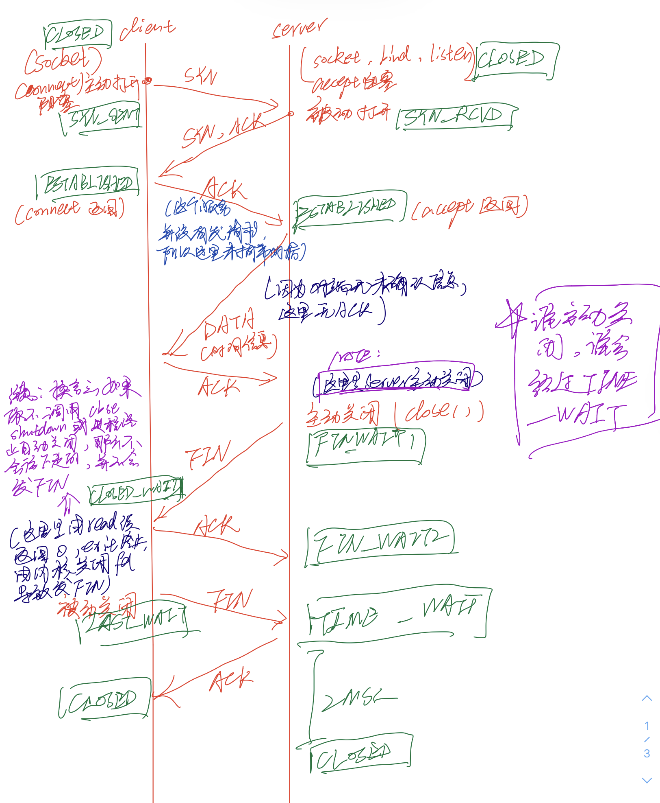

### 2.5

令牌网主机收到 MSS1460 所以不能，以太网主机收到 4096，但为了不分片，选择发 MTU-40。  
数据量要求不超过 MSS，但小于 MSS 的照样正常可以发。

### 2.6

89（0x59）

### 2.7

选择性确认(SACK)只确认了所选择的数据，并不是累计确认那样确定从之前所有数据到这个点，而是可以在这个 SACK 确认的点之前仍有未确认的数据。

---

### CH3 套接字编程简介

### 3.1

通过指针才能把结果返回给调用者。

### 3.2

void \*的指针值计算没有意义,C 不允许因此 void \*指针加减运算(本质是因为不知道 void \*指向的类型的大小，无法计算)，char \*的指针值计算才有意义，char \*指针加/减 1 分别代表地址加/减一个 char 类型大小的地址。

### 3.3

[代码](./exercise/ch3/3/inet_pton_loose.c) 一开始没看懂意思，然后才知道 1 是成功，0 是格式错误，-1 是其他错误，才明白这道题让我干什么。。。

---

### CH4 基本 TCP 套接字编程

### 4.1

看非全 0、全 1 之类的地址，比如 #define INADDR_MAX_LOCAL_GROUP ((in_addr_t) 0xe00000ff) /\* 224.0.0.255 \*/ 而我的 linux 正是小端机器，所以可以看出是主机序。

### 4.2

另外如果移动到 connect() 前，那么结果如图  
  
说明确实是 connect() 建立连接，内核才会给 socket 绑定了一个 ip(ip 如果是多宿主机有多个外出接口(网卡，有多个 ip 可选的情况)，那么具体是哪一个 ip 地址取决于路由算法的结果)和临时端口

### 4.3

按题意顺序  
1 子进程关闭 listenfd  
2 子进程关闭 connfd，因为父进程仍然有 connfd，所以并未关闭连接
3 父进程关闭 connfd，此时才彻底关闭 connfd，发出 FIN，父进程发起主动关闭

### 4.4

[代码](./exercise/ch4/4/daytimetcp_sv.c) 输出 accept error: Invalid argument，这是因为 accept 的 socket 参数不是监听套接字而只是一个主动套接字，导致 EINVAL 错误

### 4.5

[代码](./exercise/ch4/5/daytimetcp_sv.c) 发现 socket 生成的一个主动套接字一开始没有分配 ip 和端口，connect 或者 listen 在发现这种情况(没有 bind 显式绑定)，内核就会自动分配一个 ip 和临时端口(linux 下 listen 分配的 ip 是通配 ip，connect 是根据路由分配一个 ip)

---

### CH5 TCP 客户/服务器程序示例

### 5.1

[代码](./exercise/ch5/1) [记录](./exercise/ch5/1/record) 差不多 TIME_WAIT 持续了 61s 左右，反推出 MSL(最大分组生命期)是 30s 左右。

一开始想给 shell 脚本加个 set-user-ID-root，结果发现不行，然后忽然想起来 linux 下因为安全性问题，不能给 shell 脚本使用这种获取特权的机制，还是老老实实 sudo 执行吧。。。

犯了个弱智错误，那就是不要 grep 程序名，因为进程结束后，内核占用端口显示 TIME_WAIT，但这个时候进程都结束了，当然没有进程名了，通过监听端口可以 grep 到。

### 5.2

fgets 把'\0'作为结尾，而二进制文件里面的值可能有对应'\0'字符，这样会导致发送适以错误的'\0'为结尾，这样可以导致这次发送的没有'\n'，让服务器阻塞在 readline，导致死锁。(这里问的是书中的 ch5 里面那个 readline 的服务器程序)

### 5.3

Telnet 把输入行后面以 \r\n 结束，而我们的程序以 \n 结束。

### 5.4

阻塞在 fgets 上不会发送第二个 FIN，只有 close 或者 shutdown 才发 FIN。之后 write 会导致对端发来 RST，但之后有可能 readline 先读到 EOF 返回 0 正常退出，也可能是 RST 先接受到导致读到错误。  
子进程退出后，自动关闭 fd，这才发 FIN，然后走完剩下的挥手过程，注意这时候虽然两端的进程都关闭了，但这个连接仍然是由内核维护着的，仍然需要正常走完步骤。

### 5.5

响应 RST(Reset the connection,连接已重置)，因为之前的已处于 EATABLISHED 状态的连接以及没了，新重启的服务器进程就只有个监听 socket，连接重置了，返回 RST。

### 5.6

[代码](./exercise/ch5/6/cl.c) 注意发现服务器主动关闭后发来一个 FIN，然后客户端休眠后再发请求，就会因为连接已重置(断开)导致收到 RST 响应，之后再写一个已收到 RST 的 socket，在本地(根本不会发报文)，就会发现，然后内核发来一个 SIGPIPE 信号，如果忽略、捕获，那么回到 write 后 errno 设置 EPIPE。  
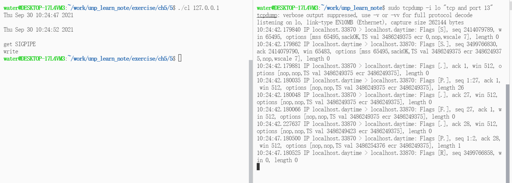

### 5.7

绝大多数 IP 实现都是弱端系统模型，指定的目的 IP 只要是目的主机的一个接口就行，实际到达的接口(通过路由实际到达的接口)可以与客户指定的目的 IP 接口不同，如果是强端实现那么必须指定的和实际到达的 IP 接口一致。  
在这里 linux 内核实现的 IP 是弱端的，所以此处无影响。

### 5.8

假设 64 位系统：

```txt
注意，计算机里面只有补码的概念
实际发送  01 00  00  00 (HEX)
         x  x+1 x+2 x+3
小端解释 1 （00 00 00 01）
大端解释 16777216（01 00 00 00）
```

1 和 2 的情况：  
01 00 00 00 + 02 00 00 00 = 16777216 + 33554432 = 03 00 00 00 ，发回小端客户端，按小端解释就是 3

-22 -77 ：
ea ff ff ff + b3 ff ff ff = 9e ff ff fe ，发回小端客户端，按小端解释就是 fe ff ff 9e（这个是纯数值补码）的值，换成原码 81 00 00 62，就是 -16777314

### 5.9

不行，因为如果是 64 位系统，long 是 64 位，htonl 和 ntohl 只能 32 位，错误。

### 5.10

会造成永久阻塞，32 位客户机发送 2 两个 32 位值到缓冲区，64 位服务器等待两个 64 位值，而缓冲区的两个 32 位值被接受到一个 64 位值取走，剩下一个 64 位值的读取会永远阻塞。

### 5.11

IP 路由功能，根据目的 IP 地址，查路由表确定外出接口和下一跳，这个接口的主 IP 地址用做源 IP 地址，前提是未绑定 bind 到一个地址，bind 后则内核不再分配。

---

### CH6 I/O 复用：select 和 poll 函数

### 6.1

```c
   __fd_mask __fds_bits[__FD_SETSIZE / __NFDBITS];
=> fd_mask fd_set::__fds_bits[16]
=> long fd_set::__fds_bits[16]
```

可见 fd_set 里面就一个 long 的数组，因为 C 不允许数组直接赋值，但允许结构体直接赋值，所以给数组包装一个结构体即可。

### 6.2

write 要写入的数据如果大于 socket 当前缓冲区可用的空间(如果是大于 socket 缓冲区的最大大小，那么会分批写入，不会永远阻塞)会阻塞，直到可用空间足够大，所以非阻塞 write 可能返回正值也可能阻塞，不会像 read 一样能返回不足值，只能设置非阻塞，这个时候是写入能写入的大小，返回一个不足值。  
这样避免了阻塞，非常重要，如果在 write 处长时间甚至永远阻塞，这个单进程服务器根本无法处理服务。

### 6.3

由于每次都是先检查 sockfd，而且是二选一，那么 sockfd 不停就绪可以让另一个 fd 处于饥饿。  
另外 select 不会实际读写数据，所以这次就绪但没操作，那么下一次会立即得知这个就绪。

### 6.4

[代码实现](./exercise/ch6/4/sv.c) 就是简单地把软限制改到内核所允许的最大，即硬限制，这样就能使用内核所允许的资源的硬上限了。  
RLIMIT_NOFILE 是最大的打开文件描述数。

### 6.5

首先配置下/etc/inetd.conf 配置文件(对于 stream 就用 nowait，对于内置程序就 internal，其他照抄)，然后重启 inetd 服务，注意我的 ubuntu 需要安装 inetd，且使用的名字是 openbsd-inetd，直接用 inetd service 是不认识的(可以 service --status-all 查看运行的服务的状态)。  
然后 telnet 查看下是不是开了这项服务,telnet 127.0.0.1 19 然后是结果——自动生成一大堆的字符，说明没问题了，剩下的就是简单的做题了。  
[代码实现](./exercise/ch6/5/cl.c)  
然后抓包进行解析，注意本机环回地址不会经过以太网卡，所以如果要监测 localhost 需要-i lo。

```bash
sudo tcpdump -i lo 'tcp and port 19' > a// 抓包，并把数据写入文件,并等待一些时间
//可以使用script之类的程序，这样还可以在终端中看见
more a | grep 'localhost.chargen >'
// grep看的清楚点，因为客户端不向服务器发报文，只是单纯的ack确认
```

首先没有 shutdown 直接 pause(),正常发来数据，直到缓冲区满发送阻塞  
开始是正常发送  
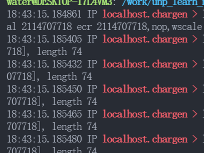  
然后就是缓冲区满了，不再发了  
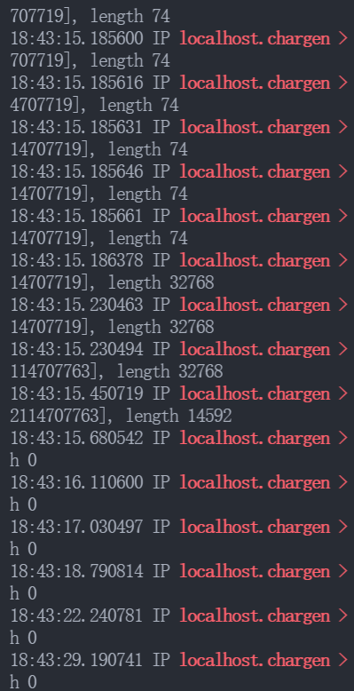  
然后添加代码 shutdown(SHUT_RD);发现结果和上面一样，说明 linux 的实现不会扔掉缓冲区中收到的数据(其他实现可能会扔掉)，但之后的所有的 read 会得知 EOF(返回 0)，注意不是返回-1 错误。

### 6.6

这个是因为 shutdown 不管引用计数的问题，直接发送 FIN；而 close()只有引用计数变成 0 才会发 FIN 是关闭，其他情况的 close() 只是单纯单纯减少打开文件描述的引用计数而已。

### 6.7

read 返回错误，然后终止程序。  
如果是多进程这样子进程终止还算可以接受，但对着用一个进程处理所有请求的服务器，这显然是不可能接受的，需要针对 errno 错误类型进行不同的处理。

### 6.8

[代码实现](./exercise/ch6/8/sv.c)

---

### CH7 套接字选项

### 7.1

[代码实现](./exercise/ch7/1/demo.c) 注意下这个是默认值，建立连接后如果不是 MSS 的倍数可能会被内核自动向上舍入到 MSS 的倍数。

### 7.2

[代码实现](./exercise/ch7/2/demo.c) 下面是运行结果：

```txt
TCP default MSS: 536
TCP receive buffer default size: 131072
TCP after connected MSS: 32741
TCP receive buffer after connected size: 131072
```

MSS 建立连接前是默认值(一般是 536)，建立连接后,(准确来说是第一次接受到对端的 SYN 报文后),得到真实的 MSS 值并设置。

而接收缓冲区建立连接前是默认值，建立连接后获得了 MSS 值，而接收缓冲区大小应该是 MSS 的倍数(一些优化问题的结果)，如果之前的接受缓冲区大小默认值不符合 MSS 倍数就可能被(大部分实现)内核自动向上舍入成 MSS 倍数。

### 7.3

[代码实现](./exercise/ch7/3)

1. 正常关闭
   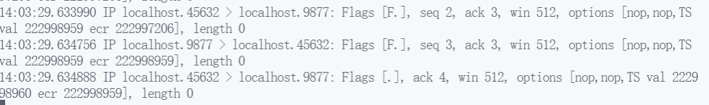  
   这是正常的四次挥手过程，虽然是三个分组，但这是因为四次挥手过程中第二步 ACK 可以被第三步服务器发 FIN 捎带,因为我这里是服务器子进程收到 EOF 立即终止，如果读到 EOF(对端 close 导致)后服务器子进程没有立即终止或 close/shutdown(发 FIN)，让 ACK 延滞的定时器超时就不会捎带这个 ACK。  
     
   然后 netstat 看下主动关闭的客户端端口，发现这个端口处于 TIME_WAIT 状态。

2. 使用 SO_LINGER(强烈不能这样用，只是实验)
   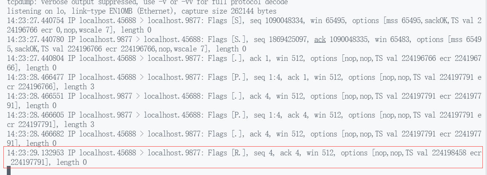  
   可以看见不再经过四次挥手，客户端进程直接发送 RST 到那个服务器的子进程。  
     
   同样的，当这个 socket 不经过四次挥手正常关闭，自然而然没有 TIME_WAIT 状态了，而是直接变成 CLOSED 状态。

### 7.4

第一个处于 bind 的时候，另一个会出错 EADDRINUSE，但 bind 后 connect，那么就可以了。所以可以重复 bind 忽略 EADDRINUSE 错误直到成功。  
不过这个没什么实际意义，看了答案才知道，不要在意。

### 7.5

懒得看 sock 程序，以后有空再补 to do

### 7.6

懒得看 sock 程序，以后有空再补 to do

### 7.7

书上答案说不起任何作用，因为 SO_DEBUG 只对 TCP 起作用，而 ping 用的是 ICMP。

### 7.8

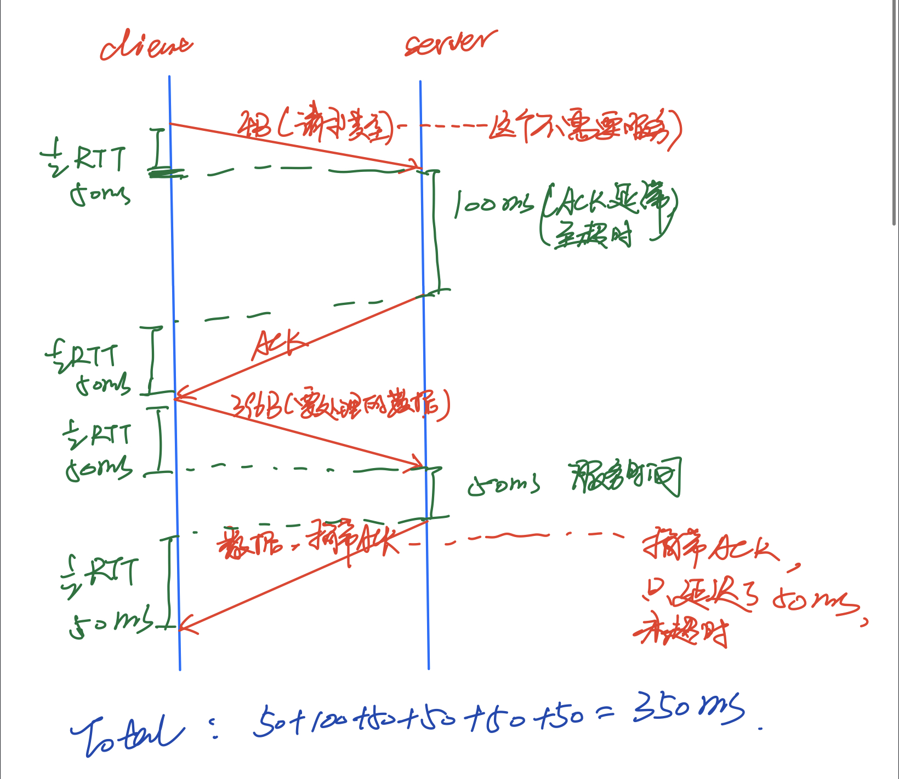

### 7.9

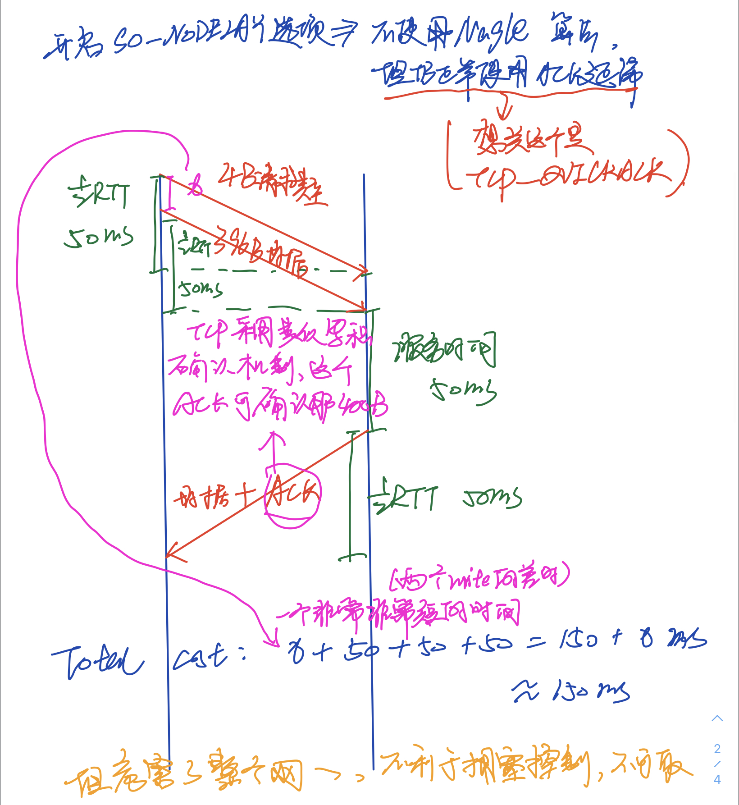

### 7.10

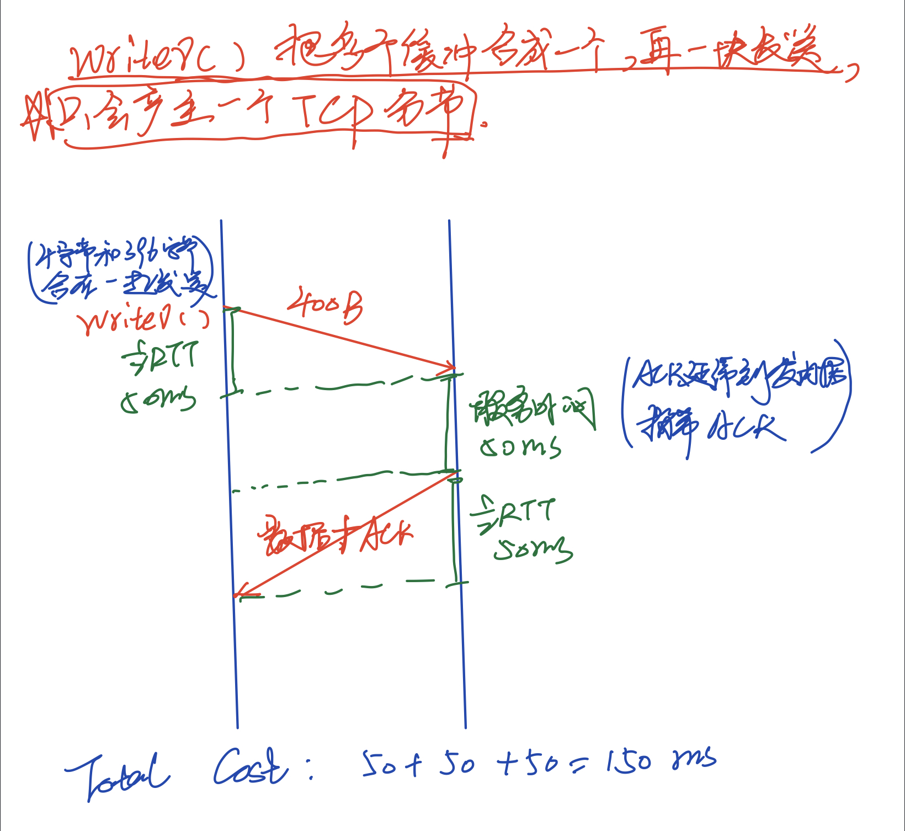

### 7.11

> A TCP SHOULD implement a delayed ACK, but an ACK should not be excessively delayed; in particular, the delay MUST be less than 0.5 seconds, and in a stream of full-sized segments there SHOULD be an ACK for at least every second segment.

### 7.12

首先注意主机崩溃关闭没有重启的情况(本质和连接不存在的主机一样)，网络上发的报文就无法到达，如果是这种情况，行为是不断尝试重连(按 1、2、4、8...的间隔)直到最后套接字出现 ETIMEOUT 错误。但如果中间路由器判断最终目的主机不可达，产生 ICMP 的错误(unreachable)这样，就会套接字错误 EHOSTUNREACH 或 ENETUREACH，不用等待超时了。(注意套接字错误之后，如 connect、read、write 对套接字的操作就会返回这个错误)

而主机崩溃重启的意思是，服务器进程关闭了，没有再监听那个端口的，但客户发的请求能通过网络到达目的主机，因为重启了，但是服务器主机收到后找不到监听这个端口的，没有这个服务，所以服务器主机会自动发给客户 RST 报文。

5-2 最耗时的地方是 accept 阻塞，5-3 最耗时的地方是 read 阻塞。服务器设置了 SO_KEEPALIVE,意思是过了一段时间(默认是 2h)两个方向上都没有数据交换，设置了 SO_KEEPALIVE 的这个服务器子进程(父进程的监听套接字不可能建立连接根本不受一点影响)会向对端发送试探性报文。但是对面主机崩溃且不重启，如同上一段所说的第一种情况，那么要么是不断尝试最后 ETIMEOUT 错误，要么是中途收到了 ICMP 的 unreachable 错误直接返回响应错误。

### 7.13

5-5 最耗时的地方是 fgets,过了一段时间(默认是 2h)两个方向上都没有数据交换，客户会向对端发送试探性报文，对端无响应造成套接字错误(不考虑 ICMP 错误的情况下是 ETIMEOUT)，但因为客户进程阻塞在对 STDOUT_FILENO 的读上，不会调用对套接字的 write，无法发现已经产生的套接字错误。

### 7.14

最耗时是 select。这个改善了上一问，套接字出现错误，select 就不再阻塞套接字，然后就立即返回错误。

### 7.15

要注意客户和服务器虽然都设置了 SO_KEEPALIVE 选项，但显然设置的时间，调用 setsockopt 的时间是不同的，所以到时的时间点是不同的，一先以后，而前一个发了探测报文后对端就不再发了，所以只有一个探测报文和它的 ACK，所以是两个而不是四个。

### 7.16

早期没有 listen 系统调用，用来创建的监听套接字的方式。

---

### CH8 基本 UDP 套接字编程

### 8.1

分别是 4096 和 2048。  
TCP 基于字节流，所以是缓冲区大小容纳的下的情况下，能从 socket 缓冲区拿多少字节拿多少；而 UDP 基于消息，一次 readfrom 就算缓冲区够大也只会读一个消息。

### 8.2

参数可能真的指向通用套接字地址结构，那这个大小可能是大于 recvfrom 后实际套接字地址大小，导致错误。

### 8.3

太过简单，略

### 8.4

由于可能 linux 和 unix 有区别的问题，我使用 ping -v 是看不到 ICMP 错误信息的，所以我使用了 tcpdump 查看 icmp 的报文，当 udp 客户端向一个主机的一个未被 bind 的 udp 端口发送，引发了 unreachable 的 icmp 错误。

### 8.5

监听套接字不会收发数据，有没有无所谓。  
另外通过套接字选项指定的 TCP 的发送和接受缓冲区大小其实是个上限，并不是预先分配，而是之后实际收发数据才分配，不过这些细枝末节都无所谓。

### 8.6

[代码实现](./exercise/ch8/6) 书上答案已经通过 sock 给我们示范过一次 bind 的作用，但因为我并不知道 sock 的源代码，让人云里雾里的，所以下面我来用我自己的代码验证一次。

需要注意的是，linux 是弱端系统实现，所以说 bind 只是让源地址设置成我们绑定的 IP，实际上走的接口可以不是，接口无所谓只要能到就行。

1. 首先看一下客户端 bind 的作用，可以改变绑定的源地址。
   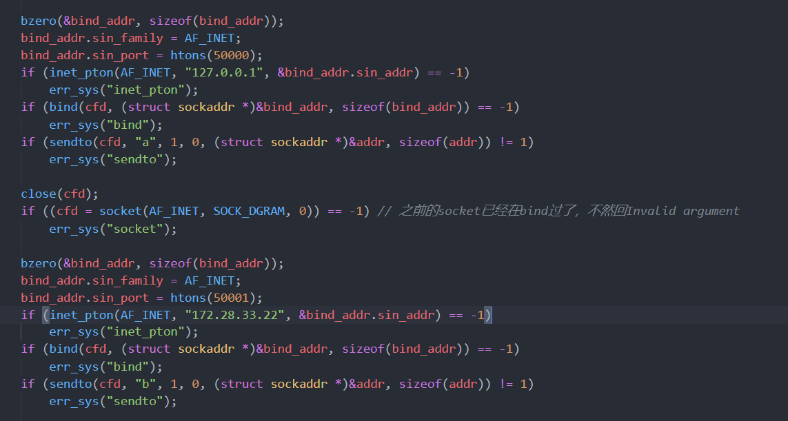 客户端修改源地址  
   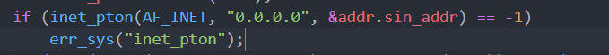  
   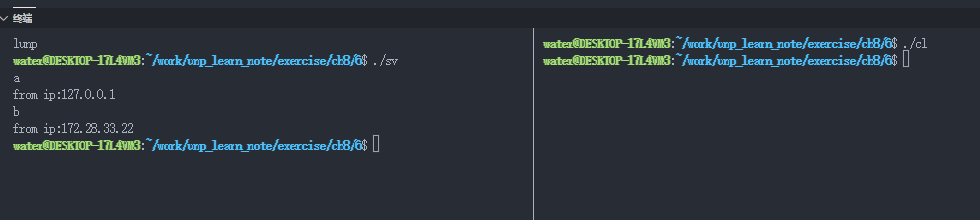

2. 然后看一下服务器 bind 的作用，注意这个 bind 的作用是只接受服务器 bind 绑定的那个端口上来的报文，这个服务器上的网络接口对应的是客户端发的报文的的目的 ip 地址。
   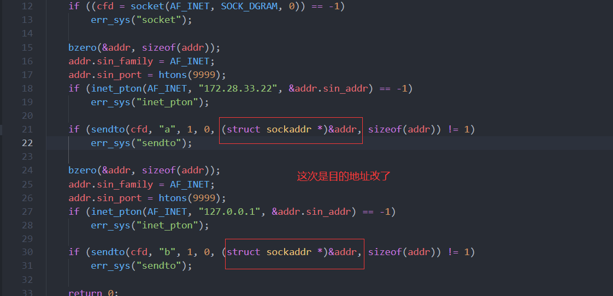 客户端修改目的地址(sendto 的参数)  
   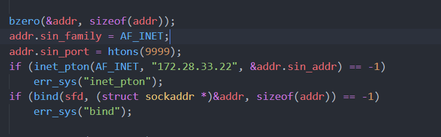  
   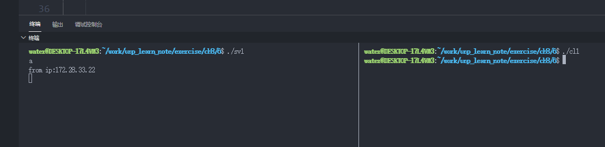

### 8.7

会影响，printf 引入一个延迟，分别让客户发的慢一些，服务器接受慢一些。

### 8.8

IPv4 数据报的总长度字段 16 位最大是 65535，这个长度是包含头部的，所以 65535-20(IP 头)-8(UDP 头)是 65507 字节；而 IPv6 不开特大净荷选项是 65535，这个是净荷不包含 IP 头，所以是 65535-8 是 65527 字节。  
[代码实现](./exercise/ch8/8) 实验下发送最大和超过最大限制的 UDP 数据报会发生什么。  
可见最大就是 65507，超过就会出错,errno 是 EMSGSIZE。  
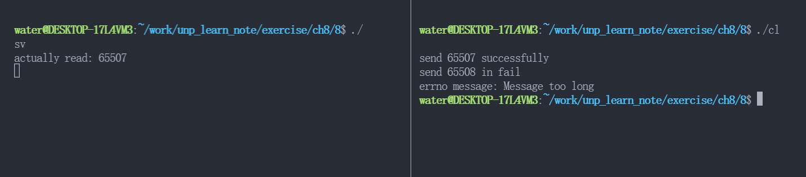

### 8.9

<!-- [代码实现](./exercise/ch8/9/sv.c) --> 还没看完 ch7 to do

---

### CH11 名字与地址转换

### 11.1 and 11.2

[代码实现](./exercise/ch11/1/hostent.c) 要知道 gethostbyname 和 gethostbyaddr 都是不可重入的，且这两个函数都是使用同一个静态数据结构，所以这两个函数之间是会相互影响的（比如覆盖掉原来的结果）。

注意 gethostbyaddr 的 socklen_t 参数是对应的二进制网络序的地址长度，IPv4 都是 4，不要用 sizeof，因为字符串可能还有别的信息在前四个字节的地址之后，不全是地址，可以用 gethostbyname 返回的 h_length。

这个使用的是复制方式实现，另一种方式是调用可重入版本。

### 11.3

太过简单，略

### 11.4

[代码实现](./exercise/ch11/4/cl.c) 看答案才知道什么鬼。。。意思是虽然 getnameinfo 也能正确处理数值字符串的形式地址，但这是在先假设这是主机名查不到的情况下，才试着作为数值字符串解释处理，而查主机名要 DNS 解析，网络需要一定时间，所以可以先 inet_pton 试试看这是不是一个数值字符串，不是的情况再作为主机名处理。

另外注意下 inet_ntop 返回 1 是正确，0 是给的字符串不符合要求，-1 是其他错误。

### 11.5

书中答案的问题：gethostbyname 不支持 IPv6，所以这里的支持是毫无作用的(当然代码本身没错，只是有没有根本无所谓)，因为实际上 gethostbyname 只可能返回 IPv4 的内容，根本用不到。

[代码实现](./exercise/ch11/5/cl.c) 而且 gethostbyname 已被 POSIX 标准废弃，你应该使用 getaddrinfo 来处理 IPv4 和 IPv6。

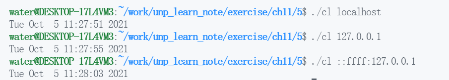

### 11.6

[代码实现](./exercise/ch11/6/cl.c)

### 11.7

通过一个大的通用地址结构(比如 sockaddr 或者 sockaddr_storage),然后调用 getsockname 获取本端的 socket 套接字结构即可，getsockname 的地址长度是值结果参数。

分配一个足够大的缓冲区或者直接用 sockaddr_storage 这个新式通用套接字地址结构(这个的大小就是最大的套接字地址大小)，因为这里是要真的放进去，所以一定要足够大，不然会 overflow。千万不要用 sockaddr，因为实际上 sockaddr 只能放得下 IPv4 十六个字节，IPv6 的 28 字节和更大的套接字结构根本放不下,另外要实际保存一个套接字结构的情况，比如 accept 和 recvfrom 之类的，如果有非 IPv4 的套接字类型，一定不能用 sockaddr，因为放不下。

另外 sockaddr_in6 的大小明明比 sockaddr 结构大，那么各种 API 也会要求把指针类型转成 sockaddr*，这是因为各种套接字结构前面的 family 字段的位置都相同，sockaddr*可以正常获取这个字段，然后得知我们要处理的套接字的类型，然后把这个指针的类型再转回去就可以了。

再注意一点，那就是 IPv4 和 IPv6 套接字类型是定长的，但其他的例如 UNIX 套接字就是变长的，所以传递的真实套接字大小是有用的，另外也许也有检查的作用，当发现真实套接字大小和对应的 family 应该的大小不同。

### 11.8

[代码实现](./exercise/ch11/8/sv.c) NI_NUMERICHOST | NI_NUMERICSERV 即可,这样就避免了查 DNS 和/etc/services 文件，单纯把网络序的二进制转成主机序的十进制表达形式而已。

另外 NI_MAXHOST，NI_MAXSERV 可以当最大的主机和端口名(或者数值字串)的长度。

### 11.9

还没看完 ch7 to do

### 11.10

trying 后面跟着 ip 说明已经 getnemeinfo 完成；然后 connected 这个是个过去式，说明 connect 完成。

### 11.11

[代码实现](./exercise/ch11/11/getnameinfo_timeout.c) 我打算通过定时器+信号处理的方式来处理超时，另外我直接选简单的 alarm 了，如果要支持其他精度，请使用对应的定时器函数。

没法测试因为根本遇不到那种阻塞那么久的情况，测试了很多网址以及不存在的 IP，都是非常快的返回，错误也基本非常快的返回。

---
